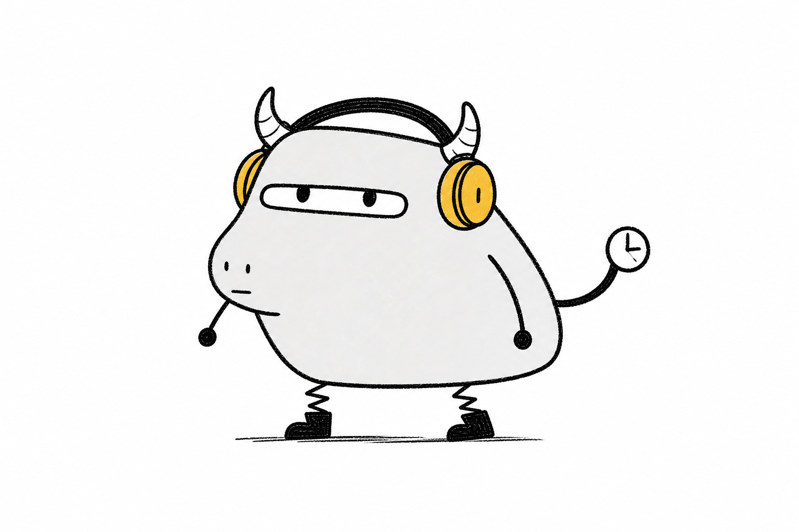
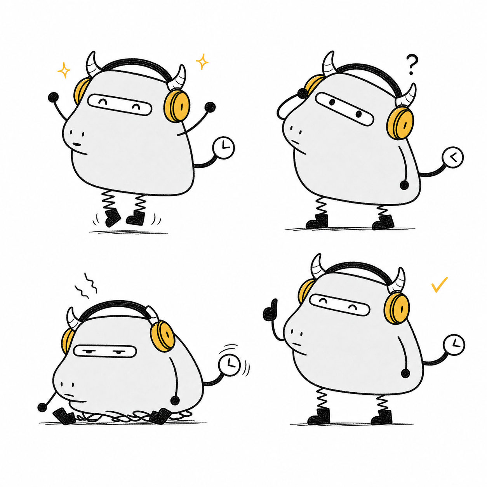

# 小K Skill

GitHub: https://github.com/lzsrain/xiao-k-illustration





小K Skill 是一个可安装的 AI Agent Skill，用统一的原创角色小K为公众号、小红书、抖音、视频号、文章、博客和 Vlog 生成手绘视觉。

小K是一只总在赶时间的几何牛马：戴黄色耳机，有一双困倦横眼、钟表尾巴和弹簧腿。它不是技术大神，而是一个会卡住、会返工，也会继续把事情做完的普通行动者。

## 能做什么

- 从中文正文中选择真正需要配图的认知节点
- 先输出简短 shot list，再按需生成单张插图
- 生成 K 状态图、教程步骤图、工作流场景、平台封面和 2-4 格短漫画
- 生成 Vlog 章节卡、短视频转场图、片尾卡和角色贴纸
- 在不同画面中保持角色颜色、轮廓和行为一致
- 在生成后执行角色一致性与版权边界检查

## 安装

把仓库中的 `xiao-k-illustration/` 目录复制到 Agent 的 skills 目录。

Codex：

```powershell
Copy-Item -Recurse -Force .\xiao-k-illustration "$env:USERPROFILE\.codex\skills\xiao-k-illustration"
```

通用 Agent 工作区：

```powershell
Copy-Item -Recurse -Force .\xiao-k-illustration .\.agents\skills\xiao-k-illustration
```

安装后重新加载 Agent，再直接说：

```text
用小K给这篇文章设计 4 张正文配图。
```

## 仓库结构

```text
xiao-k-illustration/
├── SKILL.md
├── agents/openai.yaml
├── assets/
└── references/
```

仓库根目录中的 README、许可、来源说明和贡献指南面向维护者，不会随 Skill 默认加载。

## 许可

- Skill 指令、脚本和仓库代码：MIT License
- 小K角色参考图、示例图和视觉资产：CC BY 4.0
- `小K`、`小K Skill` 的来源标识和官方视觉标识不随上述许可授权，详见 [TRADEMARK.md](TRADEMARK.md)

使用 KK 视觉资产时，请保留合理署名：

```text
小K character by Kairo, licensed under CC BY 4.0.
```

## 独立创作声明

本项目的正式角色参考图来自 Kairo 与图像生成工具的多轮原创设计迭代，不包含第三方角色文件。创作过程和边界见 [PROVENANCE.md](PROVENANCE.md)。

## 致谢

本项目在设计“如何把文章观点转成角色动作”和组织 Skill 文件结构时，参考了 Ian 的开源项目 [Ian Xiaohei Illustrations](https://github.com/helloianneo/ian-xiaohei-illustrations)。在此基础上，我们围绕多平台内容生产重新设计了工作流，并独立创作了小K的角色形象、身份锚点、平台规则、提示词、构图规范和示例素材。

小K Skill 不包含小黑角色资产，也不复用该项目的示例图片、具体构图或角色设定。感谢 Ian 将这套思路公开分享。
